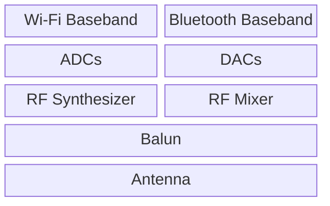

# Architecture

## Hardware

### General
Wireless communications on the ESP32 chip are interfaced via an RF (Radio Frequency) [peripheral designed by Riviera-Waves](https://www.ceva-ip.com/press/espressif-licenses-and-deploys-ceva-bluetooth-in-esp32-iot-chip/) (now [Ceva-Waves](https://www.ceva-ip.com/)).

### Diagram

**NOTE:** This diagram is an "educated" guess. If you know any better or seek someone to blame for incorrectness: [Frostie314159](https://github.com/Frostie314159).

### Description
The air interface on the ESP32 consists of two parts. The first is the RF frontend, which is in charge of everything analog. The second is the basebands, which implement the physical layer for WiFi and Bluetooth. Data is shared between these two, in the form of a digital quadrature signal.

#### Basebands
As previously stated, the basebands implement the PHY of WiFi and Bluetooth. Each baseband is it's own peripheral and is controlled individually.

#### RF Frontend
The RF frontend contains a balun, RF synthesizer, RF mixer, RF switch and an analog/digital frontend consisting of two ADCs and two DACs. The reason there are two is, that the ESP32 uses complex/IQ sampling. When a signal arrives from one of the basebands, it passes through the DACs and gets converted to an IQ signal, which then passes through the RF switch and enters the mixer, where it's converted to RF. For receiving it's the whole processes in reverse.
The purpose of the RF switch is to select between the TX and RX paths inside the chip. It can also be set to bridge TX and RX which is used for calibrating the IQ imbalance caused by manufacturing inaccuracies.

## Software
The hardware on the ESP32 is controlled by proprietary blobs, which are interfaced with through a shallow API.
### WiFi
The WiFi peripheral on the ES32 is controlled by two FreeRTOS tasks, one of which handles the MAC and the other one the PHY. They interface with each other through a number of message queues, on top of which an `ioctl`-interface exists. Espressif chose a SoftMAC architecture for the ESP32, with only ACKing implemented in hardware.
