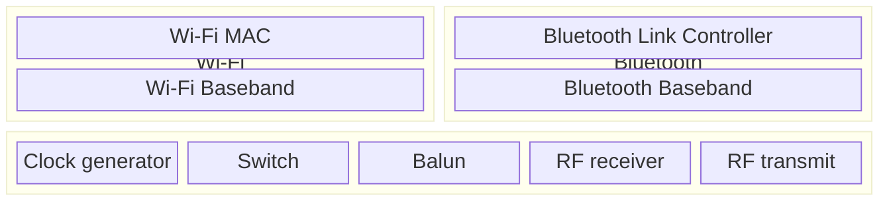

# Architecture

Wireless communications on the ESP32 chip are interfaced via an RF (Radio Frequency) [peripheral designed by Riviera-Waves](https://www.ceva-ip.com/press/espressif-licenses-and-deploys-ceva-bluetooth-in-esp32-iot-chip/) (now [Ceva-Waves](https://www.ceva-ip.com/)).

On top of that, software stacks for Wi-Fi, Bluetooth and others can be run.