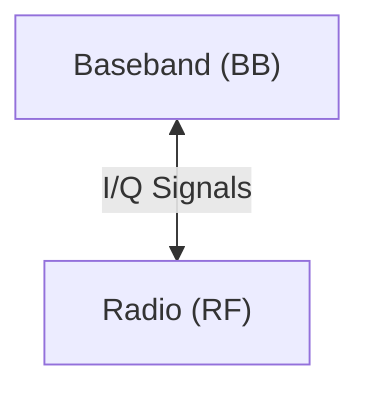

# Architecture

## Hardware

The above diagram is a simplified guess of the hardware structure of ESP32 wireless communication hardware. The air interface on the device consists conceptually of two main parts represented above.

The first part is the RF (Radio) frontend, which is in charge of everything analog and the conversion from analog to digital and vice-versa.

The second part is the BB (Baseband), which implement the physical layer for WiFi and Bluetooth.

Data is shared between these two, in the form of a digital I/Q signal (In-phase and Quadrature signal) samples.

## Software

The hardware on the ESP32 is controlled by proprietary blobs, which are interfaced with through a shallow API.

The mentioned blobs range in complexity depending on the peripheral they control. WiFi baseband seems to be comprised from a couple of FreeRTOS tasks while Bluetooth baseband appears to include an scheduler, events, many tasks and message echange mechanisms.
