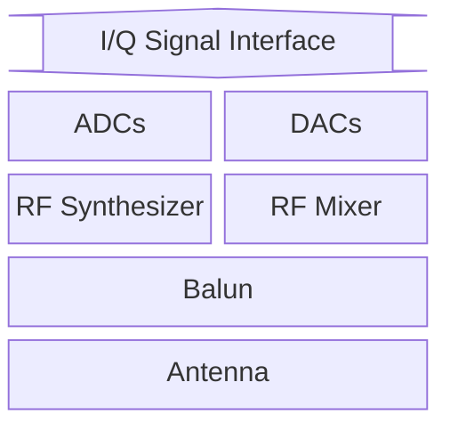

# Radio

Wireless communications on the ESP32 chip are interfaced via an RF (Radio Frequency) [peripheral designed by Riviera-Waves](https://www.ceva-ip.com/press/espressif-licenses-and-deploys-ceva-bluetooth-in-esp32-iot-chip/) (now [Ceva-Waves](https://www.ceva-ip.com/)).

The diagram below ilustrates the main hardware components of the RF frontend of the chip.

The RF frontend contains a balun, RF synthesizer, RF mixer, RF switch and an analog/digital frontend consisting of two ADCs and two DACs.

The reason there are two is, that the ESP32 uses complex/IQ sampling. When a signal arrives from one of the basebands, it passes through the DACs and gets converted to an IQ signal, which then passes through the RF switch and enters the mixer, where it's converted to RF. For receiving it's the whole processes in reverse.

The purpose of the RF switch is to select between the TX and RX paths inside the chip. It can also be set to bridge TX and RX which is used for calibrating the IQ imbalance caused by manufacturing inaccuracies.
